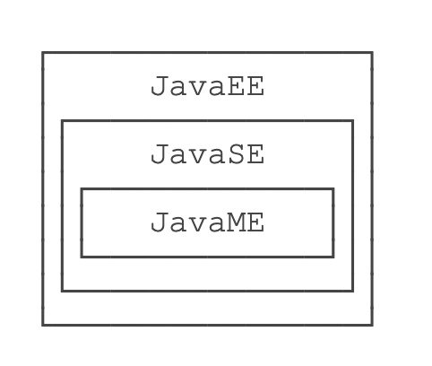
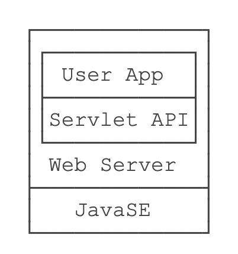
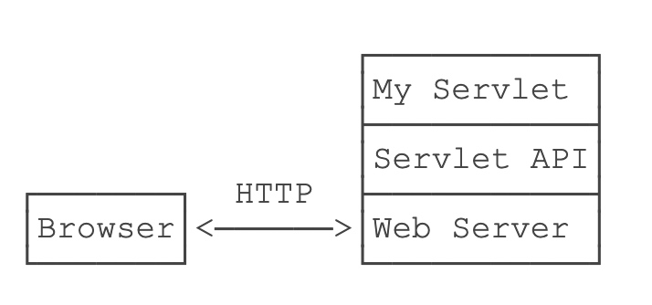
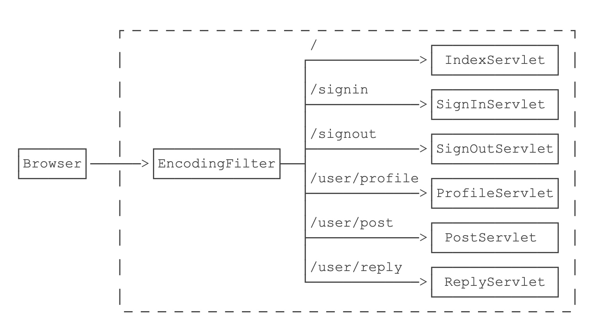
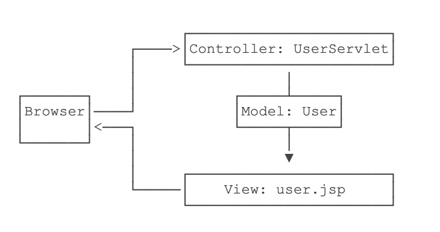
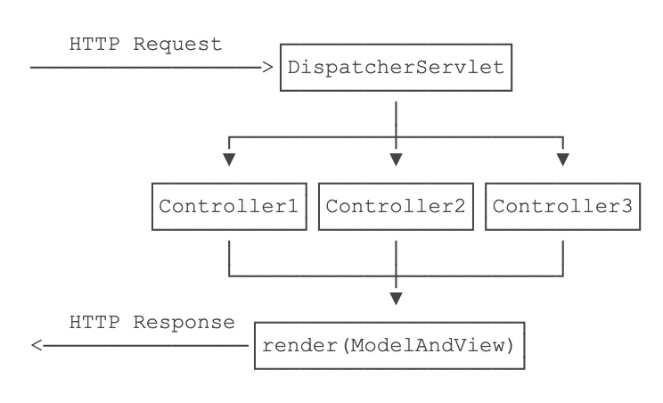

这几天看了下廖雪峰的《Java 教程》Web 开发的几个章节，对 Java Web 的技术体系算是有了一点点认识，在此摘录下。

# 几个 E



- JavaSE，简单的理解为标准版 JDK
- JavaME，裁剪后的「微型版」JDK，现在使用很少，不用管它
- JavaEE，并不是一个软件产品，它更多的是一种软件架构和设计思想。我们可以把 JavaEE 看作是在 JavaSE 的基础上，开发的一系列基于服务器的组件、API 标准和通用架构

JavaEE 最核心的组件就是基于 Servlet 标准的 Web 服务器，开发者编写的应用程序是基于 Servlet API 并运行在 Web 服务器内部的。如下图



此外，JavaEE 有一系列的技术标准

- EJB：Enterprise JavaBean，企业级 JavaBean，早期经常用于实现应用程序的业务逻辑，现在基本被轻量级框架如 Spring 所取代
- JMS：Java Message Service，用于消息服务
- JTA：Java Transaction API，用于分布式事务
- ...

目前流行的基于 Spring 的轻量级 JavaEE 开发架构，使用最广泛的是 Servlet 和 JMS，以及一系列开源组件。

# 基于 Servlet 的 Web 开发

## Servlet

在 JavaEE 平台上，处理 TCP 连接，解析 HTTP 协议这些底层工作统统扔给现成的 Web 服务器去做，我们只需要把自己的应用程序跑在 Web 服务器上。为了实现这一目的，JavaEE 提供了 Servlet API，我们使用 Servlet API 编写自己的 Servlet 来处理 HTTP 请求，Web 服务器实现 Servlet API 接口，实现底层功能



写一个最简单的 Servlet

```
// WebServlet 注解表示这是一个 Servlet，并映射到地址 /
@WebServlet(urlPatterns = "/")
public class HelloServlet extends HttpServlet {
    protected void doGet(HttpServletRequest req, HttpServletResponse resp)
            throws ServletException, IOException {
        // 设置响应类型:
        resp.setContentType("text/html");
        // 获取输出流:
        PrintWriter pw = resp.getWriter();
        // 写入响应:
        pw.write("<h1>Hello, world!</h1>");
        // 最后不要忘记flush强制输出:
        pw.flush();
    }
}
```

Servlet 应用一般会打成 war 包。

普通的 Java 程序是通过启动 JVM，然后执行 main() 方法开始运行。但是 Web 应用程序有所不同，我们无法直接运行 war 文件，必须先启动 Web 服务器，再由 Web 服务器加载我们编写的 HelloServlet，这样就可以让 HelloServlet 处理浏览器发送的请求。

常见的支持 Servlet API 的 Web 服务器有

- Tomcat：由 Apache 开发的开源免费服务器
- Jetty：由 Eclipse 开发的开源免费服务器
- GlassFish：一个开源的全功能 JavaEE 服务器

到这里，一个 Servlet 应用从编写到运行就能串起来了。

## JSP

不过，从上面可以看出，如果要输出 HTML 的话，需要自己格式化进行输出，太麻烦，这样也就有了 JSP

```
<html>
<head>
    <title>Hello World - JSP</title>
</head>
<body>
    <%-- JSP Comment --%>
    <h1>Hello World!</h1>
    <p>
    <%
         out.println("Your IP address is ");
    %>
    <span style="color:red">
        <%= request.getRemoteAddr() %>
    </span>
    </p>
</body>
</html>
```

整个 JSP 的内容实际上是一个 HTML，但是稍有不同

- 包含在 `<%--` 和 `--%>` 之间的是 JSP 的注释，它们会被完全忽略
- 包含在 `<%` 和 `%>` 之间的是 Java 代码，可以编写任意 Java 代码
- 如果使用 `<%= xxx %>` 则可以快捷输出一个变量的值

当然，还有其它的一些语法，这里了解下 JSP 文件长什么样就行。

## Filter

为了把一些公用逻辑从各个 Servlet 中抽离出来，JavaEE 的 Servlet 规范还提供了一种 Filter 组件，即过滤器。它的作用是，在 HTTP 请求到达 Servlet 之前，可以被一个或多个 Filter 预处理，类似打印日志、登录检查等逻辑，完全可以放到 Filter 中

例如，我们编写一个最简单的 EncodingFilter，它强制把输入和输出的编码设置为 `UTF-8`

```
@WebFilter(urlPatterns = "/*")
public class EncodingFilter implements Filter {
    public void doFilter(ServletRequest request, ServletResponse response, FilterChain chain)
            throws IOException, ServletException {
        System.out.println("EncodingFilter:doFilter");
        request.setCharacterEncoding("UTF-8");
        response.setCharacterEncoding("UTF-8");
        chain.doFilter(request, response);
    }
}
```

添加了Filter之后，整个请求的处理架构如下



上面 Filter 的过滤路径都是 `/*`，它会对所有请求进行过滤。也可以编写只对特定路径进行过滤的 Filter，比如

```
@WebFilter(urlPatterns = "/user/*")
```

这样就只过滤以 `/user/` 开头的路径。

## Listener

除此之外，JavaEE 的 Servlet 规范还提供了第三种组件 Listener，顾名思义就是监听器。有好几种 Listener，其中最常用的是 ServletContextListener，我们编写一个实现了 ServletContextListener 接口的类如下

```
@WebListener
public class AppListener implements ServletContextListener {
    // 在此初始化 WebApp，例如打开数据库连接池等
    public void contextInitialized(ServletContextEvent sce) {
        System.out.println("WebApp initialized.");
    }

    // 在此清理 WebApp，例如关闭数据库连接池等
    public void contextDestroyed(ServletContextEvent sce) {
        System.out.println("WebApp destroyed.");
    }
}
```

任何标注为 @WebListener，且实现了特定接口的类会被 Web 服务器自动初始化。上述 AppListener 实现了 ServletContextListener 接口，它会在整个 Web 应用程序初始化完成后，以及 Web 应用程序关闭后获得回调通知。我们可以把初始化数据库连接池等工作放到 contextInitialized() 回调方法中，把清理资源的工作放到 contextDestroyed() 回调方法中，因为 Web 服务器保证在 contextInitialized() 执行后，才会接受用户的 HTTP 请求。

除了 ServletContextListener 外，还有几种 Listener

- HttpSessionListener：监听 HttpSession 的创建和销毁事件
- ServletRequestListener：监听 ServletRequest 请求的创建和销毁事件
- ServletRequestAttributeListener：监听 ServletRequest 请求的属性变化事件（即调用 ServletRequest.setAttribute() 方法）
- ServletContextAttributeListener：监听 ServletContext 的属性变化事件（即调用 ServletContext.setAttribute() 方法）

## ServletContext

一个 Web 服务器可以运行一个或多个 WebApp，对于每个 WebApp，Web 服务器都会为其创建一个全局唯一的 ServletContext 实例，我们在 AppListener 里面编写的两个回调方法实际上对应的就是 ServletContext 实例的创建和销毁。

ServletRequest、HttpSession 等很多对象也提供 getServletContext() 方法获取到同一个 ServletContext 实例。ServletContext 实例最大的作用就是设置和共享全局信息。

此外，ServletContext 还提供了动态添加 Servlet、Filter、Listener 等功能，它允许应用程序在运行期间动态添加一个组件，虽然这个功能不是很常用。

# 基于 Servlet 编写简单的 MVC 框架

通过前面可以大概了解到

- Servlet 适合编写 Java 代码，实现各种复杂的业务逻辑，但不适合输出复杂的 HTML
- JSP 适合编写 HTML，并在其中插入动态内容，但不适合编写复杂的 Java 代码

可以将两者结合起来，发挥各自的优点，避免各自的缺点。

假设我们已经编写了几个 JavaBean

```
public class User {
    public long id;
    public String name;
    public School school;
}

public class School {
    public String name;
    public String address;
}
```

在 UserServlet 中，我们可以从数据库读取 User、School 等信息，然后，把读取到的 JavaBean 先放到 HttpServletRequest 中，再通过 forward() 传给 user.jsp 处理

```
@WebServlet(urlPatterns = "/user")
public class UserServlet extends HttpServlet {
    protected void doGet(HttpServletRequest req, HttpServletResponse resp) throws ServletException, IOException {
        // 假装从数据库读取
        School school = new School("No.1 Middle School", "101 South Street");
        User user = new User(123, "Bob", school);
        // 放入 Request 中
        req.setAttribute("user", user);
        // forward 给 user.jsp
        req.getRequestDispatcher("/WEB-INF/user.jsp").forward(req, resp);
    }
}
```

在 user.jsp 中，我们只负责展示相关 JavaBean 的信息，不需要编写访问数据库等复杂逻辑

```
<%@ page import="com.itranswarp.learnjava.bean.*"%>
<%
    User user = (User) request.getAttribute("user");
%>
<html>
<head>
    <title>Hello World - JSP</title>
</head>
<body>
    <h1>Hello <%= user.name %>!</h1>
    <p>School Name:
    <span style="color:red">
        <%= user.school.name %>
    </span>
    </p>
    <p>School Address:
    <span style="color:red">
        <%= user.school.address %>
    </span>
    </p>
</body>
</html>
```

需要注意的是

- 需要展示的 User 被放入 HttpServletRequest 中以便传递给 JSP，因为一个请求对应一个 HttpServletRequest，我们也无需清理它，处理完该请求后 HttpServletRequest 实例将被丢弃
- 把 user.jsp 放到 /WEB-INF/ 目录下，是因为 WEB-INF 是一个特殊目录，Web Server 会阻止浏览器对 WEB-INF 目录下任何资源的访问，这样就防止用户通过 /user.jsp 路径直接访问到 JSP 页面
- JSP 页面首先从 request 变量获取 User 实例，然后在页面中直接输出，此处未考虑 HTML 的转义问题，有潜在安全风险

我们在浏览器访问的时候，请求首先由 UserServlet 处理，然后交给 user.jsp 渲染



我们把 UserServlet 看作业务逻辑处理，把 User 看作模型，把 user.jsp 看作渲染，这种设计模式通常被称为 MVC：Model-View-Controller，即 UserServlet 作为控制器（Controller），User 作为模型（Model），user.jsp 作为视图（View）。

通过结合 Servle t和 JSP 的 MVC 模式，我们可以发挥二者各自的优点

- Servlet 实现业务逻辑
- JSP 实现展示逻辑

但是，直接把 MVC 搭在 Servlet 和 JSP 之上还是不太好，原因如下

- Servlet 提供的接口仍然偏底层，需要实现 Servlet 调用相关接口
- JSP 对页面开发不友好，更好的替代品是模板引擎
- 业务逻辑最好由纯粹的 Java 类实现，而不是强迫继承自 Servlet

能不能通过普通的 Java 类实现 MVC 的 Controller？类似下面的代码

```
public class UserController {
    @GetMapping("/signin")
    public ModelAndView signin() {
        ...
    }

    @PostMapping("/signin")
    public ModelAndView doSignin(SignInBean bean) {
        ...
    }

    @GetMapping("/signout")
    public ModelAndView signout(HttpSession session) {
        ...
    }
}
```

上面的这个 Java 类每个方法都对应一个 GET 或 POST 请求，方法返回值是 ModelAndView，它包含一个 View 的路径以及一个 Model，这样，再由 MVC 框架处理后返回给浏览器。

如果是 GET 请求，我们希望 MVC 框架能直接把 URL 参数按方法参数对应起来然后传入

```
@GetMapping("/hello")
public ModelAndView hello(String name) {
    ...
}
```

如果是 POST 请求，我们希望 MVC 框架能直接把 Post 参数变成一个 JavaBean 后通过方法参数传入

```
@PostMapping("/signin")
public ModelAndView doSignin(SignInBean bean) {
    ...
}
```

为了增加灵活性，如果 Controller 的方法在处理请求时需要访问 HttpServletRequest、HttpServletResponse、HttpSession 这些实例时，只要方法参数有定义，就可以自动传入

```
@GetMapping("/signout")
public ModelAndView signout(HttpSession session) {
    ...
}
```

以上就是我们在设计 MVC 框架时，上层代码所需要的一切信息。

如何设计一个 MVC 框架？在上文中，我们已经定义了上层代码编写 Controller 的一切接口信息，并且并不要求实现特定接口，只需返回 ModelAndView 对象，该对象包含一个 View 和一个 Model。实际上 View 就是模板的路径，而 Model 可以用一个 Map<String, Object> 表示，因此，ModelAndView 定义非常简单

```
public class ModelAndView {
    Map<String, Object> model;
    String view;
}
```

比较复杂的是我们需要在 MVC 框架中创建一个接收所有请求的 Servlet，通常我们把它命名为 DispatcherServlet，它总是映射到 /，然后，根据不同的 Controller 的方法定义的 @Get 或 @Post 的 Path 决定调用哪个方法，最后，获得方法返回的 ModelAndView 后，渲染模板，写入HttpServletResponse，即完成了整个 MVC 的处理。以下是大致的架构图



DispatcherServlet 细节这里不做说明。

最后渲染只需要实现一个简单的 render () 方法

```
public class ViewEngine {
    public void render(ModelAndView mv, Writer writer) throws IOException {
        String view = mv.view;
        Map<String, Object> model = mv.model;
        // 根据 view 找到模板文件
        Template template = getTemplateByPath(view);
        // 渲染并写入 Writer
        template.write(writer, model);
    }
}
```

Java 有很多开源的模板引擎，常用的有

- Thymeleaf
- FreeMarker
- Velocity

他们的用法都大同小异。这里我们推荐一个使用 Jinja 语法的模板引擎 Pebble，它的特点是语法简单，支持模板继承，编写出来的模板类似

```
<html>
<body>
  <ul>
  
    <li><a href="{{ user.url }}">{{ user.username }}</a></li>
  
  </ul>
</body>
</html>
```

即变量用 `{{ xxx }}` 表示，控制语句用 `` 表示。

至此，设计一个比较高级的 MVC 需要实现的东西也都被串起来了。

本节内容没有涉及过多的细节，只是想让大家了解到，为了开发的便捷，Servlet 是怎么样一步一步被扩展的。不管是低层级的 MVC，或是比较高级的 MVC，或是以后我们要学习的新技术，都要先了解下它究竟解决了什么问题。
