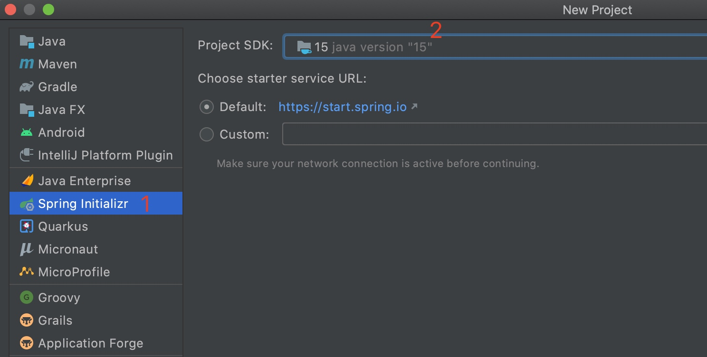
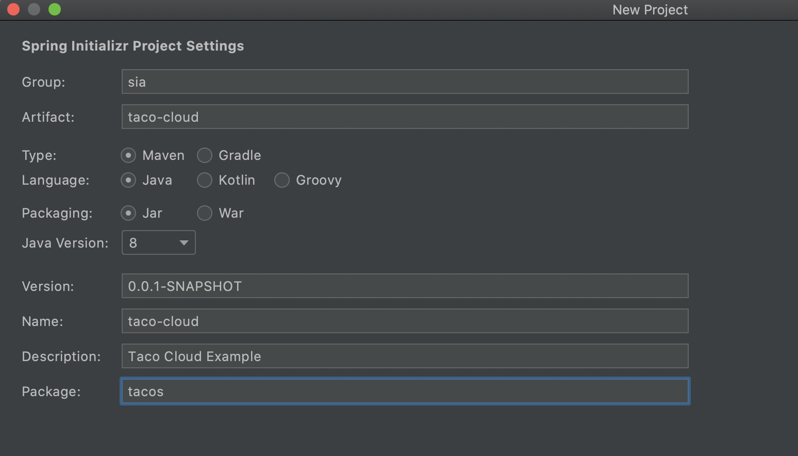
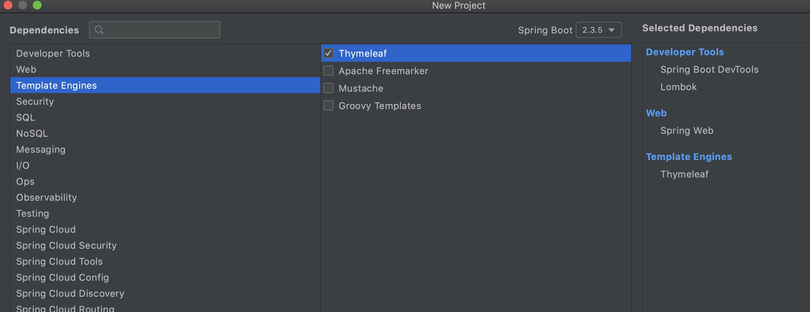
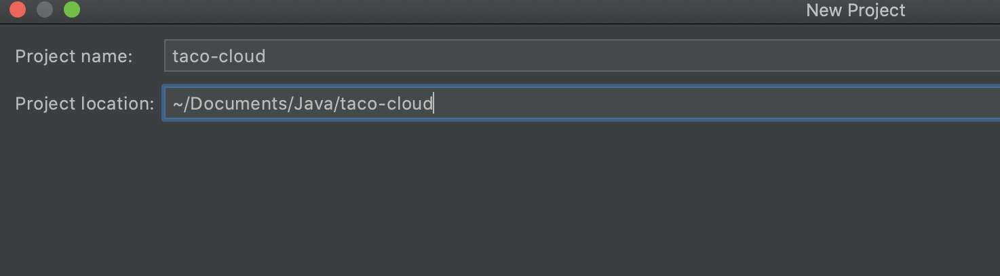
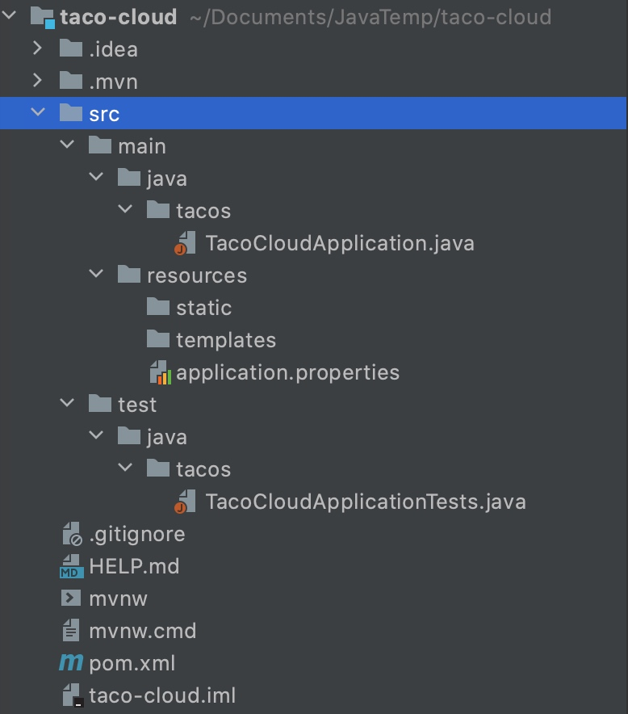
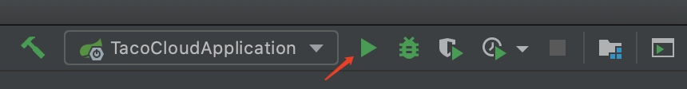
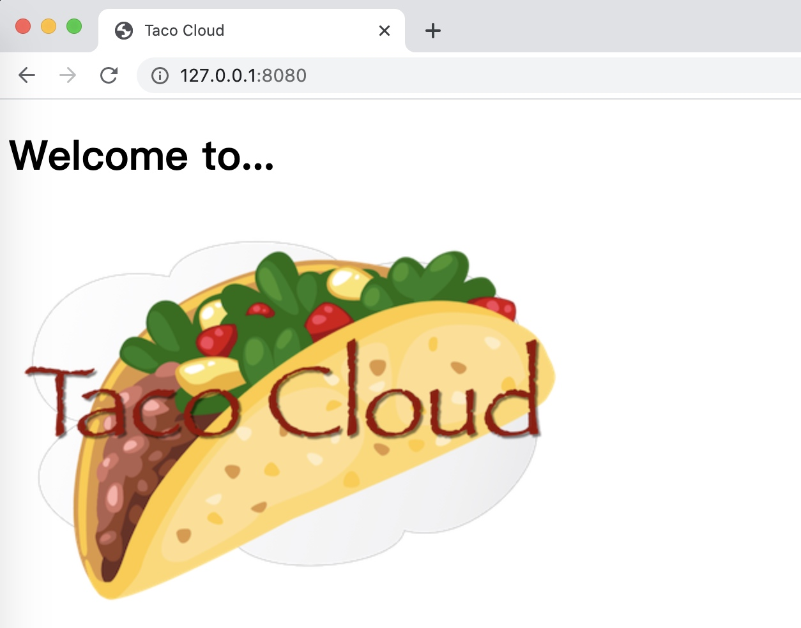

该系列笔记会创建一个 Taco Cloud 的在线应用，从应用中可以订购 Taco（墨西哥玉米卷）。通过这个项目，慢慢熟悉 Spring 的相关技术。

本文介绍怎么在 IntelliJ Java IDE 中初始化一个 Spring Boot 项目。

# 创建项目

依次点击菜单 File -> New -> Project 来到如下界面



然后点击 Next



填写完毕后点击 Next



选择好依赖后点击 Next



填好信息后点击 Finish

# 了解项目文件



- TacoCloudApplication.java：这是 Spring Boot 主类，它会启动该项目
- static：在这个文件夹下，你可以存放任意为浏览器提供服务的静态内容（图片、样式表、JavaScript 等），该文件夹初始为空
- templates：这个文件夹中存放用来渲染内容到浏览器的模板文件。这个文件夹初始是空的，不过我们很快就会往里面添加 Thymeleaf 模板
- application.properties：这个文件起初是空的，但是它为我们提供了指定配置属性的地方
- TacoCloudApplicationTests.java：这是一个简单的测试类，它能确保 Spring 应用上下文可以成功加载。在开发应用的过程中，我们会将更多的测试添加进来
- mvnw 和 mvnw.cmd：这是 Maven 包装器（wrapper）脚本。借助这些脚本，即便你的机器上没有安装 Maven，也可以构建项目
- pom.xml：这是 Maven 构建规范

看下 TacoCloudApplication.java

```
package tacos;

import org.springframework.boot.SpringApplication;
import org.springframework.boot.autoconfigure.SpringBootApplication;

@SpringBootApplication
public class TacoCloudApplication {

    public static void main(String[] args) {
        SpringApplication.run(TacoCloudApplication.class, args);
    }

}
```

@SpringBootApplication 注解明确表明这是一个 Spring Boot 应用，它组合了 3 个其他的注解

- @SpringBootConfiguration：将该类声明为配置类。尽管这个类目前还没有太多的配置，但是后续我们可以按需添加基于 Java 的 Spring 框架配置。这个注解实际上是 @Configuration 注解的特殊形式
- @EnableAutoConfiguration：启用 Spring Boot 的自动配置。我们随后会介绍自动配置的更多功能。就现在来说，我们只需要知道这个注解会告诉 Spring Boot 自动配置它认为我们会用到的组件
- @ComponentScan：启用组件扫描。这样我们能够通过像 @Component、@Controller、@Service 这样的注解声明其他类，Spring 会自动发现它们并将它们注册为 Spring 应用上下文中的组件

# 编写简单应用跑起来

添加文件 `src/main/java/tacos/HomeController.java`

```
package tacos;

import org.springframework.stereotype.Controller;
import org.springframework.web.bind.annotation.GetMapping;

// @Controller 表明这是一个控制器组件
@Controller
public class HomeController {
    
    // 处理 Get 请求 /
    @GetMapping("/")
    public String home() {
        // 返回视图名称
        return "home";
    }

}
```

添加文件 `src/main/resources/templates/home.html`

```
<!DOCTYPE html>
<html xmlns="http://www.w3.org/1999/xhtml"
      xmlns:th="http://www.thymeleaf.org">
<head>
    <title>Taco Cloud</title>
</head>

<body>
<h1>Welcome to...</h1>

</body>
</html>
```

引用图片的位置在 `src/main/resources/static/images/TacoCloud.png`

点击 IDE 右上角的 Run 按钮编译运行项目



浏览器访问 `http://127.0.0.1:8080` 就可以看到下面的页面了



至此，小 Demo 完成。

PS：相关代码以及图片文件可在 `spring-in-action/code/init-spring-boot-project` 中查看
