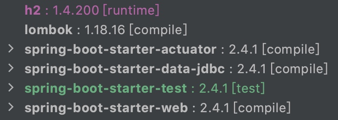
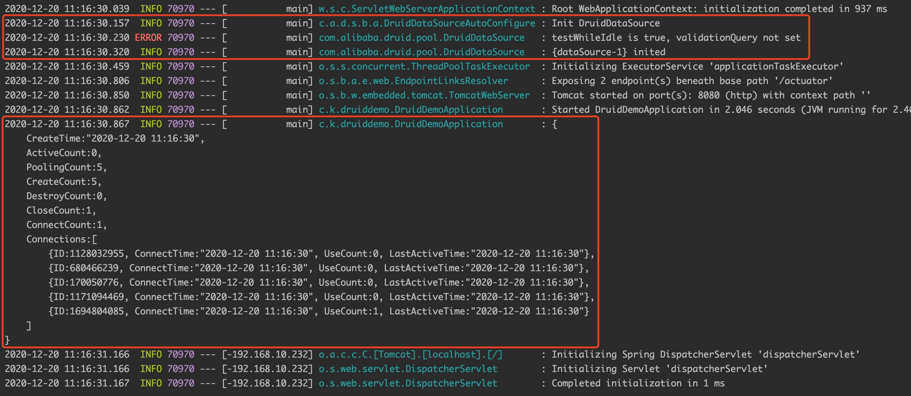
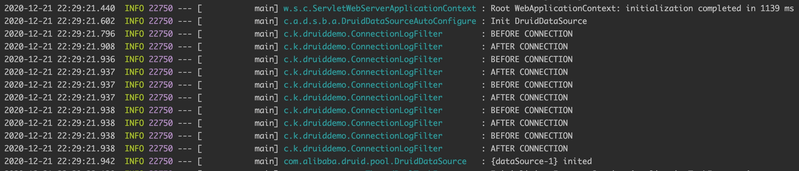

Alibaba Druid，一款数据库连接池，提供强大的监控和扩展功能。

本文介绍如何在 Spring Boot 中配置 Druid。

# 1 创建项目

使用 Spring Initializr 创建项目 `druid-demo`，依赖如下



在 `pom.xml` 中添加 Druid 依赖

```
<!-- 最新版本可通过下面地址获取 -->
<!-- https://mvnrepository.com/artifact/com.alibaba/druid-spring-boot-starter -->
<dependency>
    <groupId>com.alibaba</groupId>
    <artifactId>druid-spring-boot-starter</artifactId>
    <version>1.2.4</version>
</dependency>
```

# 2 添加配置

在文件 `druid-demo/src/main/resources/application.properties` 添加如下配置

```
# JDBC 配置
spring.datasource.url=jdbc:h2:mem:foo
spring.datasource.username=sa
spring.datasource.password=

# 连接池配置
# 初始化大小
spring.datasource.druid.initial-size=5
# 最大连接数
spring.datasource.druid.max-active=5
# 最小连接数
spring.datasource.druid.min-idle=5
```

其中

- 对于 JDBC 配置，如果是 H2 内嵌数据库的话，可以不进行设置
- 对于连接池配置，上述是几个比较常用的，完整的可参考官方文档 `https://github.com/alibaba/druid/wiki/DruidDataSource配置`


# 3 修改主类

```
package com.kevinbai.druiddemo;

import lombok.extern.slf4j.Slf4j;
import org.springframework.beans.factory.annotation.Autowired;
import org.springframework.boot.CommandLineRunner;
import org.springframework.boot.SpringApplication;
import org.springframework.boot.autoconfigure.SpringBootApplication;

import javax.sql.DataSource;

@SpringBootApplication
@Slf4j
public class DruidDemoApplication implements CommandLineRunner {

    @Autowired
    private DataSource dataSource;

    public static void main(String[] args) {
        SpringApplication.run(DruidDemoApplication.class, args);
    }

    public void run(String... args) {
        log.info(dataSource.toString());
    }

}
```

# 4 运行项目



如果看到 DruidDataSource 的相关日志以及类似的连接池信息，说明配置成功。

细心的同学会看到日志中存在 ERROR 信息，这个后面会进行说明。

# 5 其它配置

Druid 的强大之处在于它提供很多监控和扩展功能，这节介绍常用的几个。

## 5.1 测试连接

有的连接可能由于数据库重启等原因已经失效，针对类似情况我们需要在连接的不同阶段进行测试，以保证连接是可用的。Druid 对应配置如下

```
spring.datasource.druid.validation-query=SELECT 1
spring.datasource.druid.test-on-borrow=true
spring.datasource.druid.test-on-return=true
spring.datasource.druid.test-while-idle=true
```

其中，

- `validation-query` 表示用于测试的 SQL 语句
- `test-on-borrow`、`test-on-return`、`test-while-idle` 表示在连接的什么阶段进行测试，分别对应取、放以及空闲的时候，你可以根据自己的需要进行配置

在最开始启动应用的时候，会有 1 条 ERROR 日志，这是由于 Druid 默认会启用 `test-while-idle`，而当时没有设置 `validation-query` 造成的。

## 5.2 密码加密

Druid 支持直接配置加密后的密码信息。

1、生成加密密码

```
$ java -cp ~/.m2/repository/com/alibaba/druid/1.2.4/druid-1.2.4.jar \
com.alibaba.druid.filter.config.ConfigTools 123456
privateKey:MIIBVQIBADANBgkqhkiG9w0BAQEFAASCAT8wggE7AgEAAkEAwEjTNaG1gaTiQuDJqdhE475L+5d6Fb4ki4cM5ft/vOSmwybogLFwrh0/wvD663Lrnz+9EblEd9zsuOepC6ITQQIDAQABAkBNQfV66wpemL1AWcktMPQc/WzSHb6z1b4hQZXxIeflINbt+TXRdE68knPQW0Cd7cN5exLX19d8OIEdt4pIclQBAiEA8Lw1ED6KFcFiWzX4pLd/NJri+O+QZ1eN0eNPna21b7ECIQDMeiE2YWYoUqTg3i1o0Z6xJvyhumFV82S2rRDyhH7QkQIgWWouc2gnNclsVOCJB/U4BDv7Teb9RcUZYfoCGljo6SECIQC7DT40sQTy/ic2TgjcSmYRSMjyab2BExaexdMrB2m7AQIhAM5qBz5up5RIg5c7CSYCAnytLnJbZJvrg5rtdGP3TekY
publicKey:MFwwDQYJKoZIhvcNAQEBBQADSwAwSAJBAMBI0zWhtYGk4kLgyanYROO+S/uXehW+JIuHDOX7f7zkpsMm6ICxcK4dP8Lw+uty658/vRG5RHfc7LjnqQuiE0ECAwEAAQ==
password:ZuDhDcZuqjaTZ5c9O4A78BjFQx8vDuGO0GXlrCM5CAlqZPjQ2fIwFBJO3nNhvKJ0Rrc6czREBXYMLhm7+MMgew==
```

其中，123456 可设置为你需要的密码。

2、修改 JDBC 的密码为上面的 password 并启用 Druid 的解密功能

```
spring.datasource.password=ZuDhDcZuqjaTZ5c9O4A78BjFQx8vDuGO0GXlrCM5CAlqZPjQ2fIwFBJO3nNhvKJ0Rrc6czREBXYMLhm7+MMgew==

spring.datasource.druid.filter.config.enabled=true
spring.datasource.druid.connection-properties=config.decrypt=true;config.decrypt.key=${public-key}

public-key=MFwwDQYJKoZIhvcNAQEBBQADSwAwSAJBAMBI0zWhtYGk4kLgyanYROO+S/uXehW+JIuHDOX7f7zkpsMm6ICxcK4dP8Lw+uty658/vRG5RHfc7LjnqQuiE0ECAwEAAQ==
```

其中，`public-key` 为上一步生成密码时的 publicKey 信息。

## 5.3 使用 Filter

Filter 用于定制连接池操作的各个环节，常用的 Filter 有

- ConfigFilter，负责从外部获取数据源配置，在密码加密的时候就是对这个 Filter 进行了自定义配置
- WallFilter，用于防御 SQL 注入攻击
- StatFilter，用于统计监控信息。比如，通常开发人员会比较关注的慢查询问题等
- LogFilter，用于配置需要在哪些JDBC操作上进行日志记录，比如数据源，数据库连接等。目前内置了 4 种 LogFilter（Log4jFilter、Log4j2Filter、CommonsLogFilter、Slf4jLogFilter）

要使用某个 Filter 很简单，比如，如果要使用 StatFilter 和 Slf4jLogFilter，在配置文件中加入它们的别名即可

```
spring.datasource.druid.filters=stat,slf4j
```

具体有哪些别名可在文件 `druid-xxx.jar!/META-INF/druid-filter.properties` 中获取。

这种方式启用的 Filter 使用的是默认配置，如果需要对 Filter 的某些配置进行自定义，需要像上文配置 ConfigFilter 进行操作

1、启用对应 Filter

```
spring.datasource.druid.filter.config.enabled=true
```

2、添加自定义配置

```
spring.datasource.druid.connection-properties=xxx
```

这里不针对各 Filter 进行细说，有需要可以参考官方文档 `https://github.com/alibaba/druid/wiki/常见问题`。

## 5.4 自定义 Filter

当内置的 Filter 不能满足需要时，可以进行自定义。

自定义 Filter 可以继承 FilterEventAdapter，然后覆写感兴趣的方法即可。

下面我们写个 ConnectionLogFilter 用于在建立连接前后打印日志。

首先，在 `druid-demo/src/main/java/com/kevinbai/druiddemo` 新建 `ConnectionLogFilter`

```
package com.kevinbai.druiddemo;

import com.alibaba.druid.filter.FilterChain;
import com.alibaba.druid.filter.FilterEventAdapter;
import com.alibaba.druid.proxy.jdbc.ConnectionProxy;
import lombok.extern.slf4j.Slf4j;

import java.util.Properties;

@Slf4j
public class ConnectionLogFilter extends FilterEventAdapter {

    @Override
    public void connection_connectBefore(FilterChain chain, Properties info) {
        log.info("BEFORE CONNECTION");
    }

    @Override
    public void connection_connectAfter(ConnectionProxy connection) {
        log.info("AFTER CONNECTION");
    }

}
```

然后新建文件 `druid-demo/src/main/resources/META-INF/druid-filter.properties`，给 ConnectionLogFilter 取个别名 conn

```
druid.filters.conn=com.kevinbai.druiddemo.ConnectionLogFilter
```

最后在配置文件 `application.properties` 中启用该 conn

```
spring.datasource.druid.filters=stat,slf4j,conn
```

重启后我们会看到 `BEFORE CONNECTION` 和 `AFTER CONNECTION` 相关日志



说明自定义 Filter 成功。

当然，上面介绍的功能还只是 Druid 的一部分，更全面的可以参考官方文档 `https://github.com/alibaba/druid/wiki/常见问题`。

# 6 小结

Druid 是一款提供强大的监控和扩展功能的数据库连接池。本文先介绍了其数据源的配置，然后对测试连接、Filter 相关配置也做了一些说明。

相关源码：[druid-demo](https://github.com/kevinbai-cn/spring-demos/tree/master/druid-demo)。

# 7 参考

- https://t.hao0.me/db/2016/06/20/druid-filter.html
