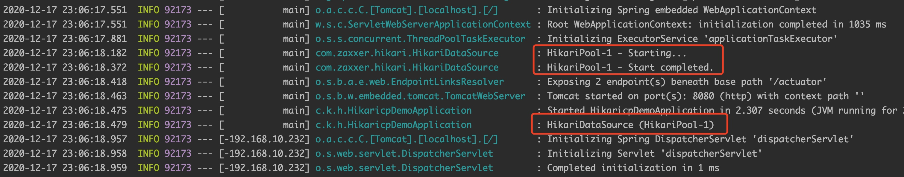

HikariCP，一款 JDBC 连接池。其名字来自日语，意思是「光」，意在表达这是个高性能连接池，很快。

为什么快呢？一方面，字节码级别的优化；另一方面，代码中有很多小改进，比如无锁集合 ConcurrentBag、代理类的优化等。如果对细节感兴趣，可以参考官方说明 `https://github.com/brettwooldridge/HikariCP/wiki/Down-the-Rabbit-Hole`。

本文介绍如何在 Spring Boot 中配置 HikariCP。

# 1 创建项目

使用 Spring Initializr 创建项目 `hikaricp-demo`，依赖如下


# 2 添加配置

Spring Boot 2.x 版本中默认使用 HikariCP 作为连接池，所以直接在文件 `application.properties` 中加入以下配置

```
# JDBC 配置
spring.datasource.url=jdbc:h2:mem:foo
spring.datasource.username=sa
spring.datasource.password=

# 连接池配置
# 最大连接数
spring.datasource.hikari.maximumPoolSize=10
# 最小空闲连接数
spring.datasource.hikari.minimumIdle=10
# 连接空闲多久后被关闭
spring.datasource.hikari.idleTimeout=600000
# 从池中获取连接的超时时间
spring.datasource.hikari.connectionTimeout=30000
# 连接最长存活时间
spring.datasource.hikari.maxLifetime=1800000
```

其中

- 对于 JDBC 配置，如果是 H2 内嵌数据库的话，可以不进行设置
- 对于连接池配置，上述是几个比较常用的，完整的可参考官方文档 `https://github.com/brettwooldridge/HikariCP#configuration-knobs-baby`

# 3 修改主类

修改主类 `src/main/java/com/kevinbai/hikaricpdemo/HikaricpDemoApplication.java` 为

```
package com.kevinbai.hikaricpdemo;

import lombok.extern.slf4j.Slf4j;
import org.springframework.beans.factory.annotation.Autowired;
import org.springframework.boot.CommandLineRunner;
import org.springframework.boot.SpringApplication;
import org.springframework.boot.autoconfigure.SpringBootApplication;

import javax.sql.DataSource;

@SpringBootApplication
@Slf4j
public class HikaricpDemoApplication implements CommandLineRunner {

    @Autowired
    private DataSource dataSource;

    public static void main(String[] args) {
        SpringApplication.run(HikaricpDemoApplication.class, args);
    }

    @Override
    public void run(String... args) {
        log.info(dataSource.toString());
    }

}
```

# 4 运行项目



看到类似的 Hikari 相关日志说明配置成功。

# 5 小结

Spring Boot 中配置 HikariCP 比较简单，直接在配置文件中加入 JDBC 和连接池相关配置就行。

相关源码：[hikaricp-demo](https://github.com/kevinbai-cn/spring-demos/tree/master/hikaricp-demo)。
