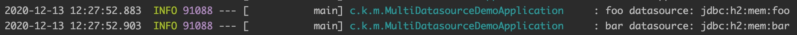

在 Spring 中配置多数据源有 2 种方式

1. 与 Spring Boot 协同工作
2. 不用 Spring Boot，手动配置多个数据源

第 2 种方式与上篇文章[《JDBC 单数据源配置》](https://github.com/kevinbai-cn/java-notes/blob/master/spring/jdbc-single-data-source-configuration.md)中的「手动配置」类似，这里不做说明。

与 Spring Boot 协同工作的话，也有 2 种方式

1. 配置 `@Primary` 类型的 Bean
2. 排除掉自动配置 DataSourceAutoConfiguration、DataSourceTransactionManagerAutoConfiguration、JdbcTemplateAutoConfiguration，手动进行多个数据源的配置

第 1 种方式适合数据源有主从之分的，否则使用第 2 种，使用的时候根据需要手动选择某个数据源。

PS：下文创建 Srping Boot 项目时所选择的依赖和上篇文章[《JDBC 单数据源配置》](https://github.com/kevinbai-cn/java-notes/blob/master/spring/jdbc-single-data-source-configuration.md)中的「自动配置」相同。

# 1 配置 `@Primary` 类型的 Bean

创建项目 `primary-datasource-demo` 后在配置文件 `src/main/resources/application.properties` 中添加数据源相关信息

```
spring.datasource.url=jdbc:h2:mem:spring
spring.datasource.username=sa
spring.datasource.password=

demo.datasource.url=jdbc:h2:mem:demo
demo.datasource.username=sa
demo.datasource.password=
```

然后修改主类 `src/main/java/com/kevinbai/primarydatasourcedemo/PrimaryDatasourceDemoApplication.java` 为

```
@SpringBootApplication
@Slf4j
public class PrimaryDatasourceDemoApplication implements CommandLineRunner {
    @Autowired
    private DataSource dataSource;

    public static void main(String[] args) {
        SpringApplication.run(PrimaryDatasourceDemoApplication.class, args);
    }

    @Bean
    @Primary
    @ConfigurationProperties("demo.datasource")
    public DataSourceProperties demoDataSourceProperties() {
        return new DataSourceProperties();
    }

    @Override
    public void run(String... args) throws SQLException {
        Connection connection = dataSource.getConnection();
        log.info("datasource {}", connection.getMetaData().getURL());
        connection.close();
    }
}
```

我们创建了 demoDataSourceProperties，而 Spring Boot 自动配置也会创建一个 dataSourceProperties，这里使用 `@Primary` 注解将前者标记为主要的，之后的 dataSource 都会依赖于这个 Bean 生成，而 dataSourceTransactionManager、jdbcTemplate 会依赖于刚刚的 dataSource 生成，这样一来数据源相关的自动配置都是以主要的配置生成的。

当然，上面只是一种思路，你也可以直接创建 dataSource 然后将其标记为 `@Primary`，也是可行的。

运行程序会看到相关日志


说明配置成功。

也可以访问 `http://127.0.0.1:8080/actuator/beans` 查看相关 Bean 信息，访问前需要在配置文件中加入如下配置并重启

```
management.endpoints.web.exposure.include=health,info,beans
```

看几个和数据源相关的 Bean

```
{
    "beans": {
        "demoDataSourceProperties": {
            ...,
            "scope": "singleton",
            "dependencies": [
                "primaryDatasourceDemoApplication"
            ]
        },
        "dataSource": {
            ...,
            "scope": "singleton",
            "dependencies": [
                "org.springframework.boot.autoconfigure.jdbc.DataSourceConfiguration$Hikari",
                "demoDataSourceProperties"
            ]
        },
        "transactionManager": {
            ...,
            "scope": "singleton",
            "dependencies": [
                "org.springframework.boot.autoconfigure.jdbc.DataSourceTransactionManagerAutoConfiguration$JdbcTransactionManagerConfiguration",
                "dataSource"
            ]
        },
        "jdbcTemplate": {
            ...,
            "scope": "singleton",
            "dependencies": [
                "org.springframework.boot.autoconfigure.jdbc.JdbcTemplateConfiguration",
                "dataSource",
                "spring.jdbc-org.springframework.boot.autoconfigure.jdbc.JdbcProperties"
            ]
        },
        ...
    }
}
```

从上面的依赖关系也可以看出配置是没问题的。

# 2 手动进行多个数据源的配置

创建项目 `multi-datasource-demo` 后在配置文件 `src/main/resources/application.properties` 中添加如下内容

```
foo.datasource.url=jdbc:h2:mem:foo
foo.datasource.username=sa
foo.datasource.password=

bar.datasource.url=jdbc:h2:mem:bar
bar.datasource.username=sa
bar.datasource.password=

management.endpoints.web.exposure.include=health,info,beans
```

首先，在主类 `src/main/java/com/kevinbai/multidatasourcedemo/MultiDatasourceDemoApplication.java` 注解 `@SpringBootApplication` 中排除数据源相关自动配置

```
@SpringBootApplication(exclude = {
        DataSourceAutoConfiguration.class,
        DataSourceTransactionManagerAutoConfiguration.class,
        JdbcTemplateAutoConfiguration.class
})
public class MultiDatasourceDemoApplication {
    public static void main(String[] args) {
        SpringApplication.run(MultiDatasourceDemoApplication.class, args);
    }
}
```

然后配置 foo 数据源

```
@Bean
@ConfigurationProperties("foo.datasource")
public DataSourceProperties fooDataSourceProperties() {
    return new DataSourceProperties();
}

@Bean
public DataSource fooDataSource() {
    DataSourceProperties dataSourceProperties = fooDataSourceProperties();
    log.info("foo datasource: {}", dataSourceProperties.getUrl());
    return dataSourceProperties.initializeDataSourceBuilder().build();
}

@Bean
public PlatformTransactionManager fooTxManager() {
    return new DataSourceTransactionManager(fooDataSource());
}
```

这里使用 fooDataSourceProperties 获取 foo 数据源相关配置并创建 fooDataSource，之后又使用 fooDataSource 创建 fooTxManager。

bar 数据源的配置类似

```
@Bean
@ConfigurationProperties("bar.datasource")
public DataSourceProperties barDataSourceProperties() {
    return new DataSourceProperties();
}

@Bean
public DataSource barDataSource() {
    DataSourceProperties dataSourceProperties = barDataSourceProperties();
    log.info("bar datasource: {}", dataSourceProperties.getUrl());
    return dataSourceProperties.initializeDataSourceBuilder().build();
}

@Bean
public PlatformTransactionManager barTxManager() {
    return new DataSourceTransactionManager(barDataSource());
}
```

启动后看到如下日志



说明配置成功。

你也可以使用 Actuator 查看 fooDataSourceProperties、fooDataSource、fooTxManager 之间的依赖关系来确认配置是否成功（bar 相关的同理），方式和上一节的类似，这里不赘述。

# 3 小结

本文主要介绍了在 Spring Boot 中创建多数据源的 2 种方式

- 配置 `@Primary` 类型的 Bean
- 手动配置多数据源

前一种适合数据源有主从之分的，否则使用后一种，使用的时候根据需要手动选择某个数据源。

相关源码：

- [primary-datasource-demo](https://github.com/kevinbai-cn/spring-demos/tree/master/primary-datasource-demo)
- [multi-datasource-demo](https://github.com/kevinbai-cn/spring-demos/tree/master/multi-datasource-demo)
