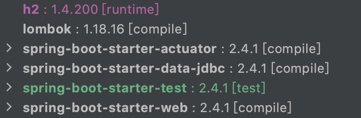
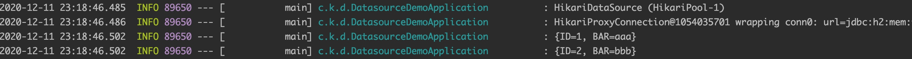
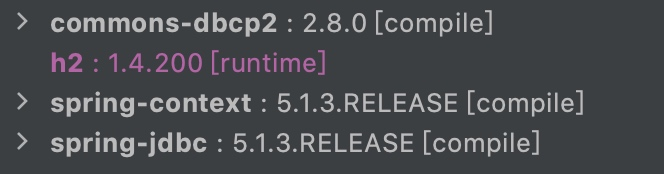
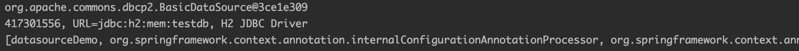

在 Spring 中配置数据源有 2 种方式

1. Spring Boot 安装相关依赖后自动配置，我们只需要指定数据源相关的部分参数
2. 手动配置

# 1 自动配置

## 1.1 创建项目

使用 Spring Initializr 创建项目，如果之前没用过可参考 [《使用 Spring Initializr 创建 Spring Boot 项目》](https://github.com/kevinbai-cn/java-notes/blob/master/spring/use-spring-initializr-to-create-spring-boot-project.md)。

我创建的时候一般都会勾选下面几个依赖

- Spring Web，用于编写 Web 应用
- Lombok，通过注解给类注入属性或者方法，减少重复代码编写
- Spring Boot Actuator，监控应用程序，可通过网页查看相关状态

由于编写 Web 应用居多，同时也会查看应用的一些状态信息，所以上面的依赖一般都会选中。

和数据源相关的依赖有 2 个

- Spring Data JDBC
- H2 Database

前者提供 JDBC 相关支持，后者是一个关系型数据库引擎，数据存储在内存，支持通过 JDBC 操作。

最后 `pom.xml` 中的依赖如下



## 1.2 配置数据源

在配置文件 `src/main/resources/application.properties` 中添加如下内容

```
spring.datasource.url=jdbc:h2:mem:testdb
spring.datasource.username=sa
spring.datasource.password=
```

H2 数据库的 url、username、password 会被修改为对应值，同时 Spring Boot 会使用如上信息进行数据源的自动配置。

## 1.3 使用数据源

修改主类为 `src/main/java/com/kevinbai/datasourcedemo/DatasourceDemoApplication.java`

```
package com.kevinbai.datasourcedemo;

import lombok.extern.slf4j.Slf4j;
import org.springframework.beans.factory.annotation.Autowired;
import org.springframework.boot.CommandLineRunner;
import org.springframework.boot.SpringApplication;
import org.springframework.boot.autoconfigure.SpringBootApplication;
import org.springframework.jdbc.core.JdbcTemplate;

import javax.sql.DataSource;
import java.sql.Connection;
import java.sql.SQLException;

@SpringBootApplication
@Slf4j
public class DatasourceDemoApplication implements CommandLineRunner {
    @Autowired
    private DataSource dataSource;

    @Autowired
    private JdbcTemplate jdbcTemplate;

    public static void main(String[] args) {
        SpringApplication.run(DatasourceDemoApplication.class, args);
    }

    @Override
    public void run(String... args) throws Exception {
        showConnection();
        showData();
    }

    private void showConnection() throws SQLException {
        log.info(dataSource.toString());
        Connection conn = dataSource.getConnection();
        log.info(conn.toString());
        conn.close();
    }

    private void showData() {
        jdbcTemplate.queryForList("SELECT * FROM FOO").forEach(row -> log.info(row.toString()));
    }
}
```

类结构上需要注意的点

- `@Slf4j` 注入 log 属性，方便使用其打印日志
- 主类实现了接口 CommandLineRunner，run 方法会在主类被装载到 Spring 容器后执行，这里用于打印数据源相关信息

主要注意这几个点

- 使用注解 `@Autowired` 注入 Spring Boot 自动配置好了的 dataSource 和 jdbcTemplate
- `showConnection()` 方法打印数据源以及连接信息
- `showData()` 打印数据库中的数据

## 1.4 查看运行情况

由于 H2 是内存型数据库，为方便查看效果，启动时需要指定数据库初始化语句，在配置文件中添加相关设置

```
# 数据定义语句（DDL），比如创建表结构等
spring.datasource.schema=classpath:schema.sql
# 数据操作语句（DML），比如增删改等
spring.datasource.data=classpath:data.sql
```

具体的 sql 文件内容如下

- src/main/resources/schema.sql

```
CREATE TABLE FOO (ID INT IDENTITY, BAR VARCHAR(64));
```

- src/main/resources/data.sql

```
INSERT INTO FOO (ID, BAR) VALUES (1, 'aaa');
INSERT INTO FOO (ID, BAR) VALUES (2, 'bbb');
```

如果没有指定 `spring.datasource.schema` 和 `spring.datasource.data`，默认会在 `src/main/resources` 查找，所以这里对于这 2 个参数的设置不是必须的。如果你需要修改目录，则需要指定这 2 个参数。

此时运行程序，会在控制台看到类似的输出



Actuator 提供了 Web 页面可以查看应用程序的 Beans 信息，不过默认没有暴露该端点，只暴露了 health 和 info，需要在配置文件中加入如下设置

```
# 多个端点以逗号分隔
management.endpoints.web.exposure.include=health,info,beans
```

修改后记得重启应用生效。此时在浏览器中访问 `http://127.0.0.1:8080/actuator/beans` 可查看所有的 Bean 信息。比如 dataSource


也可以直接使用通配符暴露所有端点

```
management.endpoints.web.exposure.include=*
```

生产环境中不建议这么使用，会暴露程序的很多信息。

如果需要查看数据库内容，可以访问 H2 的 Web 控制台。在此之前需要在配置文件中开启 H2 Console

```
spring.h2.console.enabled=true
```

现在访问 `http://127.0.0.1:8080/h2-console` 就可以进入到 H2 的控制台了。

如果需要比较全面的知道 Spring Boot 中都有哪些配置，可参考 [Common Application properties](https://docs.spring.io/spring-boot/docs/current/reference/html/appendix-application-properties.html)。

# 2 手动配置

## 2.1 创建项目

创建一个 Maven 项目，引入如下依赖



## 2.2 配置数据源

新建主类 `src/main/java/com/kevinbai/purespringdatasourcedemo/DatasourceDemo.java`

```
package com.kevinbai.purespringdatasourcedemo;

import org.apache.commons.dbcp2.BasicDataSourceFactory;
import org.springframework.beans.factory.annotation.Autowired;
import org.springframework.context.ApplicationContext;
import org.springframework.context.annotation.Bean;
import org.springframework.context.annotation.Configuration;
import org.springframework.context.support.ClassPathXmlApplicationContext;
import org.springframework.jdbc.datasource.DataSourceTransactionManager;
import org.springframework.transaction.PlatformTransactionManager;
import org.springframework.transaction.annotation.EnableTransactionManagement;

import javax.sql.DataSource;
import java.sql.Connection;
import java.sql.SQLException;
import java.util.Arrays;
import java.util.Properties;

@Configuration
@EnableTransactionManagement
public class DatasourceDemo {
    @Bean(destroyMethod = "close")
    public DataSource dataSource() throws Exception {
        Properties properties = new Properties();
        properties.setProperty("url", "jdbc:h2:mem:testdb");
        properties.setProperty("username", "sa");
        return BasicDataSourceFactory.createDataSource(properties);
    }

    @Bean
    public PlatformTransactionManager transactionManager() throws Exception {
        return new DataSourceTransactionManager(dataSource());
    }
}
```

`@Bean` 注解表示方法的返回值会作为 Bean 放到 Spring 应用上下文中。这里创建了 2 个 Bean

- dataSource，直接在代码中设置相关参数，然后通过 BasicDataSourceFactory 生成。另外，destroyMethod 参数用于设置 Bean 销毁前会调用的 Bean 方法
- transactionManager，使用 dataSource 创建的 DataSourceTransactionManager

如此，这 2 个 Bean 就可以在 Spring 的应用上下文中看到了。

当然，使用 xml 也可以配置 Bean，这里不做说明。

## 2.3 使用数据源

在获取 Spring 应用上下文之前，我们先添加应用上下文配置 `src/main/resources/applicationContext.xml`

```
<?xml version="1.0" encoding="UTF-8"?>
<beans xmlns="http://www.springframework.org/schema/beans"
       xmlns:xsi="http://www.w3.org/2001/XMLSchema-instance"
       xmlns:context="http://www.springframework.org/schema/context"
       xsi:schemaLocation="http://www.springframework.org/schema/beans
        http://www.springframework.org/schema/beans/spring-beans.xsd
        http://www.springframework.org/schema/context
        http://www.springframework.org/schema/context/spring-context.xsd">

    <context:component-scan base-package="com.kevinbai.purespringdatasourcedemo"/>
</beans>
```

在主类中添加测试方法

```
@Configuration
@EnableTransactionManagement
public class DatasourceDemo {
    @Autowired
    private DataSource dataSource;

    public static void main(String[] args) throws Exception {
        ApplicationContext applicationContext = new ClassPathXmlApplicationContext("applicationContext*.xml");
        showAppDatasource(applicationContext);
        showAppBeans(applicationContext);
    }
    
    ...

    private static void showAppDatasource(ApplicationContext applicationContext) throws SQLException {
        DatasourceDemo demo = applicationContext.getBean("datasourceDemo", DatasourceDemo.class);
        demo.showDataSource();
    }

    private void showDataSource() throws SQLException {
        System.out.println(dataSource.toString());
        Connection connection = dataSource.getConnection();
        System.out.println(connection.toString());
        connection.close();
    }

    private static void showAppBeans(ApplicationContext applicationContext) {
        System.out.println(Arrays.toString(applicationContext.getBeanDefinitionNames()));
    }
}
```

这里同样也是使用 `@Autowired` 注入之前手动配置好的数据源。

看下程序执行流程

- `main()` 方法，首先使用 ClassPathXmlApplicationContext 获取 Spring 上下文信息 applicationContext，然后调用 `showAppDatasource()` 和`showAppBeans()` 分别打印数据源和 Bean 信息
- `showAppDatasource()` 方法，使用 applicationContext 获取主类实例，并调用实例的 `showDataSource()` 方法
- `showDataSource()`，打印数据源和连接信息
- `showAppBeans()` 方法，使用 applicationContext 获取 Bean 信息并打印

## 2.4 查看运行情况

运行 `main()` 方法，可看到类似输出



# 3 小结

本文简单介绍了在 Spring 中创建数据源的 2 种方式：自动配置和手动配置。其实，所谓自动配置也就是 Spring Boot 中有一系列的自动配置类，帮我们完成了手动配置的步骤

- DataSourceAutoConfiguration，配置 DataSource
- DataSourceTransactionManagerAutoConfiguration，配置 DataSourceTransactionManager
- JdbcTemplateAutoConfiguration，配置 JdbcTemplate

当然，自动配置符合条件时才会执行，比如 DataSourceAutoConfiguration 在探测到没有 DataSource Bean 的时候才会执行。这里不用过于深入的了解自动配置的原理，先简单了解下就行。

相关源码：

- [datasource-demo](https://github.com/kevinbai-cn/spring-demos/tree/master/datasource-demo)
- [pure-spring-datasource-demo](https://github.com/kevinbai-cn/spring-demos/tree/master/pure-spring-datasource-demo)
