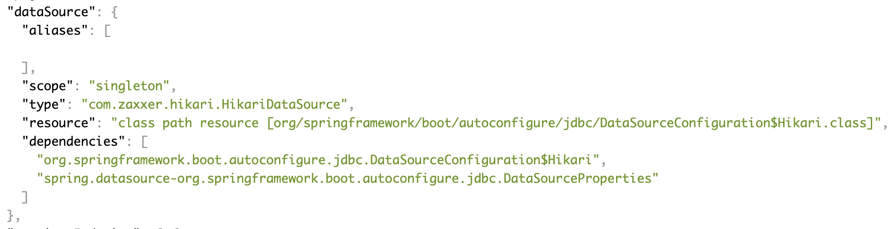

在 Spring 中配置单数据源有 2 种方式

1. Spring Boot 安装相关依赖后自动配置，我们只需要指定数据源相关的部分参数
2. 手动配置

# 1 自动配置

## 1.1 创建项目

使用 Spring Initializr 创建项目，如果之前没用过可参考 [《使用 Spring Initializr 创建 Spring Boot 项目》](./spring/use-spring-initializr-to-create-spring-boot-project.md)。

我创建的时候一般都会勾选下面几个依赖

- Spring Web，用于编写 Web 应用
- Lombok，通过注解给类注入属性或者方法，减少重复代码编写
- Spring Boot Actuator，监控应用程序，可通过网页查看相关状态

由于编写 Web 应用居多，同时也会查看应用的一些状态信息，所以上面的依赖一般都会选中。

和数据源相关的依赖有 2 个

- Spring Data JDBC
- H2 Database

前者提供 JDBC 相关支持，后者是一个关系型数据库引擎，数据存储在内存，支持通过 JDBC 操作。

最后 `pom.xml` 中的依赖如下


## 1.2 配置数据源

在配置文件 `src/main/resources/application.properties` 中添加如下内容

```
spring.datasource.url=jdbc:h2:mem:testdb
spring.datasource.username=sa
spring.datasource.password=
```

H2 数据库的 url、username、password 会被修改为对应值，同时 Spring Boot 会使用如上信息进行数据源的自动配置。

## 1.3 使用数据源

修改主类为 `src/main/java/com/kevinbai/datasourcedemo/DatasourceDemoApplication.java`

```
package com.kevinbai.datasourcedemo;

import lombok.extern.slf4j.Slf4j;
import org.springframework.beans.factory.annotation.Autowired;
import org.springframework.boot.CommandLineRunner;
import org.springframework.boot.SpringApplication;
import org.springframework.boot.autoconfigure.SpringBootApplication;
import org.springframework.jdbc.core.JdbcTemplate;

import javax.sql.DataSource;
import java.sql.Connection;
import java.sql.SQLException;

@SpringBootApplication
@Slf4j
public class DatasourceDemoApplication implements CommandLineRunner {
    @Autowired
    private DataSource dataSource;

    @Autowired
    private JdbcTemplate jdbcTemplate;

    public static void main(String[] args) {
        SpringApplication.run(DatasourceDemoApplication.class, args);
    }

    @Override
    public void run(String... args) throws Exception {
        showConnection();
        showData();
    }

    private void showConnection() throws SQLException {
        log.info(dataSource.toString());
        Connection conn = dataSource.getConnection();
        log.info(conn.toString());
        conn.close();
    }

    private void showData() {
        jdbcTemplate.queryForList("SELECT * FROM FOO").forEach(row -> log.info(row.toString()));
    }
}
```

类结构上需要注意的点

- `@Slf4j` 注入 log 属性，方便使用其打印日志
- 主类实现了接口 CommandLineRunner，run 方法会在主类被装载到 Spring 容器后执行，这里用于打印数据源相关信息

主要注意这几个点

- 使用注解 `@Autowired` 注入 Spring Boot 自动配置好了的 dataSource 和 jdbcTemplate
- `showConnection()` 方法打印数据源以及连接信息
- `showData()` 打印数据库中的数据

## 1.4 查看运行情况

由于 H2 是内存型数据库，为方便查看效果，启动时需要指定数据库初始化语句，在配置文件中添加相关设置

```
# 数据定义语句（DDL），比如创建表结构等
spring.datasource.schema=classpath:schema.sql
# 数据操作语句（DML），比如增删改等
spring.datasource.data=classpath:data.sql
```

具体的 sql 文件内容如下

- src/main/resources/schema.sql

```
CREATE TABLE FOO (ID INT IDENTITY, BAR VARCHAR(64));
```

- src/main/resources/data.sql

```
INSERT INTO FOO (ID, BAR) VALUES (1, 'aaa');
INSERT INTO FOO (ID, BAR) VALUES (2, 'bbb');
```

如果没有指定 `spring.datasource.schema` 和 `spring.datasource.data`，默认会在 `src/main/resources` 查找，所以这里对于这 2 个参数的设置不是必须的。如果你需要修改目录，则需要指定这 2 个参数。

此时运行程序，会在控制台看到类似的输出


此时在浏览器中访问 `http://127.0.0.1:8080/actuator/beans` 可查看所有的 beans 信息。比如 dataSource



如果访问出现 404，需在配置文件中允许 Actuator 暴露 beans 端点

```
management.endpoints.web.exposure.include=beans
```

修改后记得重启应用生效。如果需要暴露多个端点，可以使用逗号分隔

```
management.endpoints.web.exposure.include=health,beans
```

也可以直接使用通配符暴露所有端点

```
management.endpoints.web.exposure.include=*
```

生产环境中不建议这么使用，会暴露程序的很多信息。

如果需要知道 Spring Boot 中都有哪些配置，可参考 [Common Application properties](https://docs.spring.io/spring-boot/docs/current/reference/html/appendix-application-properties.html)


# 2 手动配置


