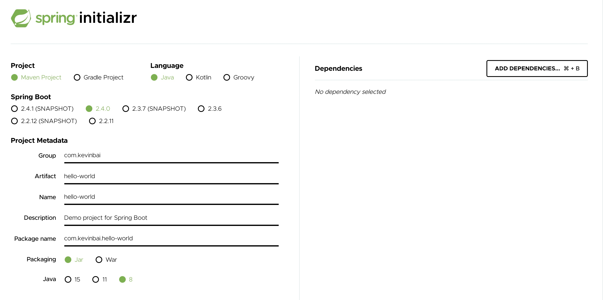

本文介绍如何使用 Spring Initializr 创建 Spring Boot 项目，然后在本地编译运行起来，并对项目结构做个简单的说明。

# 1 创建项目

访问 Spring Initializr Web 页面（`https://start.spring.io`），设置如下信息



左边选择项目的一些基础配置，右边选择依赖。

先看左边的有哪些配置

- Project，选择依赖管理工具，这里使用 Maven
- Language，选择语言，这里使用 Java
- Spring Boot，选择框架版本，这里使用最新的稳定版 2.4.0
- Project Metadata，关于项目的元数据
    - Group、Artifact 联合起来可以作为包的标识，Group 一般是公司或者组织名称，Artifact 一般是项目名称
    - Name 是 Spring Boot 入口方法所在类的名称，一般可以设置为与 Artifact 相同
    - Description，描述
    - 包名，一般由 Group 和 Artifact 组合生成
- Packaging，打包类型，这里使用 Jar
- Java，JDK 版本，这里使用 8

然后是选择依赖


现在我们只需要 Spring MVC 就行，用于编写 Web 应用


最后点击页面下方的 GENERATE 就会生成项目压缩包并下载到本地。

# 2 运行项目

解压压缩包后修改文件 `src/main/java/com/kevinbai/helloworld/HelloWorldApplication.java`

```
package com.kevinbai.helloworld;

import org.springframework.boot.SpringApplication;
import org.springframework.boot.autoconfigure.SpringBootApplication;
import org.springframework.web.bind.annotation.RequestMapping;
import org.springframework.web.bind.annotation.RestController;

@SpringBootApplication
@RestController
public class HelloWorldApplication {

	public static void main(String[] args) {
		SpringApplication.run(HelloWorldApplication.class, args);
	}

	@RequestMapping(value = "/")
	public String index() {
		return "Hello World!";
	}
}
```

相比原来的文件，变动如下

- 添加注解 `@RestController` 表明这是一个控制器，它会自动将对象序列化为 HttpResponse，一般用于编写 RESTful API
- 编写方法 index() 并用 `@RequestMapping(value = "/")`，表示如果请求服务根路径，会调用 index() 方法，并将其返回结果作为响应

之后切换到项目根目录，对项目进行打包

```
$ mvn package -Dmaven.test.skip=true
```

其中，参数 `-Dmaven.test.skip=true` 表示跳过测试阶段。

如果本地没有按照 Maven，可以直接使用项目根目录下的 `mvn` 程序。

运行 jar 文件

```
$ java -jar target/hello-world-0.0.1-SNAPSHOT.jar
```

看到类似的输出


说明启动成功，在浏览器中访问 `http://127.0.0.1:8080/` 会看到 `Hello World!` 的输出。

# 3 项目结构

现在我们回过来看下项目的结构


- HelloWorldApplication.java：Spring Boot 主类，它会启动该项目
- static：存放为浏览器提供服务的静态内容（图片、样式表、JavaScript 等）
- templates：存放用来渲染内容到浏览器的模板文件
- application.properties：配置文件
- HelloWorldApplicationTests.java：这是一个简单的测试类，它能确保 Spring 应用上下文可以成功加载
- mvnw 和 mvnw.cmd：这是 Maven 包装器（wrapper）脚本。借助这些脚本，即便你的机器上没有安装 Maven，也可以构建项目
- pom.xml：这是 Maven 构建规范

主类 HelloWorldApplication 我们刚刚看过了，这里看下 `pom.xml`

```
<?xml version="1.0" encoding="UTF-8"?>
<project xmlns="http://maven.apache.org/POM/4.0.0" xmlns:xsi="http://www.w3.org/2001/XMLSchema-instance"
	xsi:schemaLocation="http://maven.apache.org/POM/4.0.0 https://maven.apache.org/xsd/maven-4.0.0.xsd">
	<modelVersion>4.0.0</modelVersion>
	<parent>
		<groupId>org.springframework.boot</groupId>
		<artifactId>spring-boot-starter-parent</artifactId>
		<version>2.4.0</version>
		<relativePath/> <!-- lookup parent from repository -->
	</parent>
	<groupId>com.kevinbai</groupId>
	<artifactId>hello-world</artifactId>
	<version>0.0.1-SNAPSHOT</version>
	<name>hello-world</name>
	<description>Demo project for Spring Boot</description>

	<properties>
		<java.version>1.8</java.version>
	</properties>

	<dependencies>
		<dependency>
			<groupId>org.springframework.boot</groupId>
			<artifactId>spring-boot-starter-web</artifactId>
		</dependency>

		<dependency>
			<groupId>org.springframework.boot</groupId>
			<artifactId>spring-boot-starter-test</artifactId>
			<scope>test</scope>
		</dependency>
	</dependencies>

	<build>
		<plugins>
			<plugin>
				<groupId>org.springframework.boot</groupId>
				<artifactId>spring-boot-maven-plugin</artifactId>
			</plugin>
		</plugins>
	</build>

</project>
```

关注几个点

- 项目配置从 `spring-boot-starter-parent` 继承
- 设置了 groupId、artifactId、version、name、description，除版本 version 外，其它的和我们使用 Spring Initializr 创建项目时的元数据相对应
- 引入依赖 `spring-boot-starter-web` 与 `spring-boot-starter-test` 分别用于编写 Web 应用以及测试。另外，这里并没有指定依赖的具体版本，而由 `spring-boot-starter-parent` 确定
- 引入插件 `spring-boot-maven-plugin`，用于将项目打包成 jar

# 4 使用 IDE 创建项目

在 Web 页面上创建项目，需要下载，解压，最后再在编辑器或者 IDE 中打开，这样相对比较繁琐。很多 IDE 都支持直接使用 Spring Initializr 创建，这里以 IntelliJ IDEA 为例简单说明下。

在菜单项中依次打开 File -> New -> Project... 来到 New Project 窗口


选择 Spring Initializr 点击 Next。

之后的步骤就和在 Web 页面中的配置类似了，设置好对应的信息后点击下一步下一步就 OK 了。

# 5 小结

本文介绍了如何使用 Spring Initializr 创建项目，然后编写并运行了一个 Hello World Web 应用，之后对项目结构进行了简单的说明，最后以 IntelliJ IDEA 为例说明了如何在 IDE 中使用 Spring Initializr。

# 6 参考

- https://www.liaoxuefeng.com/wiki/1252599548343744/1309301146648610
- 《Spring 实战（第 5 版）》，第 1 部分（Spring 基础），第 1 章（Spring 起步），1.2.2（检查 Spring 项目的结构）
