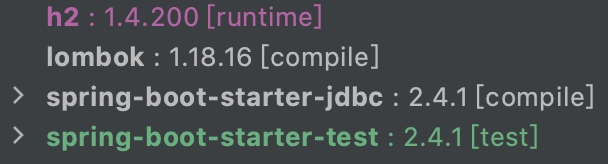

本文介绍使用 Spring JDBC 访问数据库。

Spring JDBC 主要包含下面 4 个包

- core：`org.springframework.jdbc.core`，包含 JdbcTemplate 等相关核心接口和类
- datasource：`org.springframework.jdbc.datasource`，数据源相关的辅助类
- object：`org.springframework.jdbc.object`，包含一些类，能让你以更加面向对象的方式来对数据库进行操作
- support：`org.springframework.jdbc.support`，错误码等其他辅助⼯工具

一般我们使用 core 包中的 JdbcTemplate 进行 JDBC 操作，相关的类还有 SimpleJdbcInsert、NamedParameterJdbcTemplate 等，这些类相对 JdbcTemplate 来说，简化了一些操作，后面我们会介绍。

文中相关操作都基于 foo 表

```
CREATE TABLE foo (
    id INT NOT NULL AUTO_INCREMENT,
    bar VARCHAR(64)
)
```

# 1 新增

可以使用 JdbcTemplate 的 update 方法完成插入操作

```
String bar = "a";
jdbcTemplate.update("INSERT INTO foo (bar) VALUES (?)", bar);
```

其中，SQL 中的参数以问号占位，具体值在 SQL 语句后给出，如果有多个参数，需要注意参数与值的顺序。

如果需要得到自动生成的 id，可以使用 KeyHolder

```
KeyHolder keyHolder = new GeneratedKeyHolder();
jdbcTemplate.update(connection -> {
    PreparedStatement ps = connection
            .prepareStatement("INSERT INTO foo (bar) VALUES (?)", new String[] { "id" });
    ps.setString(1, "b");
    return ps;
}, keyHolder);
Number id = keyHolder.getKey();
```

不过使用 simpleJdbcInsert 会更简洁些

```
// 先基于 jdbcTemplate 创建 simpleJdbcInsert
this.simpleJdbcInsert = new SimpleJdbcInsert(jdbcTemplate)
        .withTableName("foo").usingGeneratedKeyColumns("id");
// 然后进行插入操作
Map<String, String> row = new HashMap<>();
row.put("bar", "c");
Number id = simpleJdbcInsert.executeAndReturnKey(row);
```

前面使用 jdbcTemplate 执行 SQL 时，传入参数需要注意顺序，参数多的时候使用起来不大方便，这时可以使用 namedParameterJdbcTemplate，将参数通过映射传人即可

```
Map<String, String> row = new HashMap<>();
row.put("bar", "d");
namedParameterJdbcTemplate.update("INSERT INTO foo (bar) VALUES (:bar)", row);
```

# 2 删除

可以使用 JdbcTemplate 或者 NamedParameterJdbcTemplate 的 update 方法，只是 SQL 不同。

# 3 修改

同删除。

# 4 查询

可以使用 JdbcTemplate 的 query、queryForObject、queryForList 进行查询。

- query

比较常用的一个重载方法如下

```
public <T> List<T> query(String sql, RowMapper<T> rowMapper, @Nullable Object... args) throws DataAccessException;
```

其中，sql 和 args 分别用于指定 SQL 以及参数值（有的话才指定），rowMapper 是一个实现了 RowMapper 接口的类的实例。

RowMapper 只有一个方法 mapRow，用于指示如何将数据库中的一条记录转化为对象。

假设要获取 foo 表中的所有 id 大于等于 2 的记录，这里先定义一个实体类

```
import lombok.Builder;
import lombok.Data;

@Data
@Builder
public class Foo {
    private int id;
    private String bar;
}
```

然后填充 query 参数并打印结果

```
List<Foo> fooList = jdbcTemplate.query("SELECT * FROM foo WHERE id >= ?", new RowMapper<Foo>() {
    @Override
    public Foo mapRow(ResultSet rs, int rowNum) throws SQLException {
        return Foo.builder()
                .id(rs.getInt(1))
                .bar(rs.getString(2))
                .build();
    }
}, 2);
fooList.forEach(f -> log.info(f.toString()));
```

结果类似

```
2020-12-26 11:00:32.793  INFO ...: Foo(id=2, bar=b)
2020-12-26 11:00:32.793  INFO ...: Foo(id=3, bar=c)
2020-12-26 11:00:32.793  INFO ...: Foo(id=4, bar=d)
```

- queryForObject

比较常用的一个重载方法如下

```
public <T> T queryForObject(String sql, Class<T> requiredType, @Nullable Object... args) throws DataAccessException;
```

其中，sql 和 args 分别用于指定 SQL 以及参数值（有的话才指定），requiredType 指定需要返回的对象类型。

比如统计 foo 表中记录行数

```
int count = jdbcTemplate.queryForObject("SELECT COUNT(*) FROM foo", Integer.class);
log.info("{}", count);
```

结果类似

```
2020-12-26 11:37:19.677  INFO ...: 4
```

- queryForList

比较常用的一个重载方法如下

```
public <T> List<T> queryForList(String sql, Class<T> elementType, @Nullable Object... args) throws DataAccessException
```

其中，sql 和 args 分别用于指定 SQL 以及参数值（有的话才指定），elementType 表示返回的列表中的元素类型。

比如，获取 foo 表中的所有 bar 值

```
List<String> barList = jdbcTemplate.queryForList("SELECT bar FROM foo", String.class);
barList.forEach(log::info);
```

结果类似

```
2020-12-26 11:46:39.688  INFO ...: a
2020-12-26 11:46:39.688  INFO ...: b
2020-12-26 11:46:39.688  INFO ...: c
2020-12-26 11:46:39.688  INFO ...: d
```

# 5 其它操作

你可以使用 jdbcTemplate 的 execute 执行任意的 SQL 语句。该方法一般用于执行一些 DDL 语句，比如创建表、修改表索引等。

下面语句可以创建本文例子使用的表 foo

```
jdbcTemplate.execute("CREATE TABLE foo (id INT NOT NULL AUTO_INCREMENT, bar VARCHAR(64))");
```

需要注意的是，本文为了说明相关操作，源码中使用的是这种方式。如果使用的是 Spring Boot，建议直接使用 schema.sql 进行初始化操作。

# 6 批处理

当需要执行多条类似的 SQL 时，可以使用批处理。相比于在语言层面使用迭代执行多次，批处理会减少应用和数据库服务器间交互的次数，所以效率要高一些。

批处理可以使用 JdbcTemplate 的 batchUpdate 方法，比较常用的一种重载方法是

```
public int[] batchUpdate(String sql, BatchPreparedStatementSetter pss) throws DataAccessException;
```

其中，sql 用于指定要执行的 SQL，pss 是实现了 BatchPreparedStatementSetter 接口的类的实例。

BatchPreparedStatementSetter 有 2 个方法

- setValues，用于设置 SQL 中参数对应的值
- getBatchSize，设置该批次要执行的语句的条数

假设现在有如下的 fooList

```
List<Foo> fooList = new ArrayList<>();
fooList.add(Foo.builder().bar("bar1").build());
fooList.add(Foo.builder().bar("bar2").build());
```

将 fooList 中的 2 个对象使用批处理插入到数据表中

```
jdbcTemplate.batchUpdate("INSERT INTO foo (bar) VALUES (?)", new BatchPreparedStatementSetter() {
    @Override
    public void setValues(PreparedStatement ps, int i) throws SQLException {
        ps.setString(1, fooList.get(i).getBar());
    }

    @Override
    public int getBatchSize() {
        return fooList.size();
    }
});
```

当然，也可以使用 NamedParameterJdbcTemplate 的 batchUpdate 方法，比较常用的一种重载方法是

```
public int[] batchUpdate(String sql, SqlParameterSource[] batchArgs);
```

其中，sql 用于指定要执行的 SQL，batchArgs 是一个 SqlParameterSource 数组，可以使用 SqlParameterSourceUtils 中的 createBatch 方法生成。

将 fooList 中个对象使用 NamedParameterJdbcTemplate 的 batchUpdate 方法插入到数据表中

```
namedParameterJdbcTemplate.batchUpdate("INSERT INTO foo (bar) VALUES (:bar)",
        SqlParameterSourceUtils.createBatch(fooList));
```

需要注意的是，上面用于批处理的 SQL 其实是可以合并为 1 条 INSERT 语句的，这里旨在说明批处理的用法。如果是多条 UPDATE 语句且更新的特定字段的值是不同的话，就不能使用修改 SQL 的方式达到目的了，类似的情况使用批处理就是有必要的。

# 7 小结

本文介绍了如何使用 JdbcTemplate 完成增、删、改、查、批处理等操作，同时也介绍了如何使用 SimpleJdbcInsert、NamedParameterJdbcTemplate 对一些操作进行简化。

需要注意的是，文中涉及的 update、query、queryForObject、queryForList、batchUpdate 等都有多种重载方法，我都只介绍了常用的一种，目的是能让大家快速了解某个方法的功能。对于其它的重载方法，需要时可以通过搜索引擎或者官方文档查下是怎么使用的，有了本文的基础后，这个过程应该比较顺畅，毕竟已经了解了 JdbcTemplate 的一些基本用法。

相关源码：[simple-jdbc-demo](https://github.com/kevinbai-cn/spring-demos/tree/master/simple-jdbc-demo)。

源码使用 Spring Initializr 生成，依赖如下



另外说明下，类 `com.kevinbai.simplejdbcdemo.FooDao` 使用了注解 `@Repository`，它有 2 个层面的作用

- 类似注解 `@Component`，可以被 Spring Boot 自动扫描到，并在需要时实例化为 Bean 放入到 Spring 容器中
- 代表该类担任着数据访问层的角色，其中一个好处是，如果类中用了类似 Hibernate 之类的持久化框架，其抛出的数据库异常都会被都会被转为 Spring 中的异常类 DataAccessExeption 的子类，这里暂不细说，有个了解就行

# 8 参考

- https://docs.spring.io/spring-framework/docs/current/reference/html/data-access.html#jdbc
